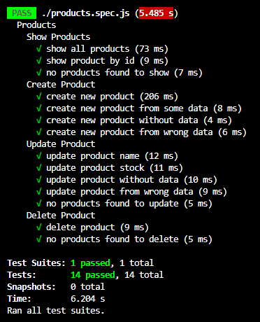

# Test Case แบบ Unit Testing สำหรับ API ในระบบจัดการสินค้า (Product Management System)
Task Week 4 : Back-End Dev for Dev Init

เพื่อทดสอบกระบวนการทำงานของ API ในระบบจัดการสินค้า (Product Management System) เราจึงเลือกใช้ Testing Framework ที่ชื่อ **"Jest"** และ **"Supertest"** ในการทำ Test Case แบบ Unit Testing

โดย API ในระบบจัดการสินค้า (Product Management System) ของเรานั้น มี Function หลักที่จะทำการ Test อยู่ 4 Function ด้วยกัน คือ
- Function Show Products
- Function Create Product
- Function Update Product
- Function Delete Product

## การทำ Unit Testing สำหรับ API
Unit Testing ที่เราทำ เพื่อให้ครอบคลุมกับการใช้งาน API ทั้ง 4 Function ให้มากที่สุด จึงจัดเป็น Test ทั้งหมด 14 Case ซึ่งผู้ใช้สามารถทำการ Test ได้โดยรัน Code
```
npm run test
```


และนี่คือผลลัพธ์ที่ได้จากการ Test จากภาพจะเห็นว่ากระบวนการทำงาน API ของเราสามารถรัน Test ผ่านทั้ง 14 Case โดยมีรายละเอียดของ Test แต่ละ Case ใน Function ต่างๆ ดังนี้

### - Function Show Products
Function นี้จะมี Test ทั้งหมด 3 Case ด้วยกัน คือ
- **Show all products** ผ่านการ Request แบบ `GET localhost:5000/products`
- **Show product by id** ผ่านการ Request แบบ `GET localhost:5000/products/{id}`
- **No products found to show** ผ่านการ Request แบบ `GET localhost:5000/products/{id}` โดยใช้ id ที่ไม่มีข้อมูล จากตัวอย่างใน Test ใช้ id เป็นค่า 9999999999

### - Function Create Product
Function นี้จะมี Test ทั้งหมด 4 Case ด้วยกัน คือ
- **Create new product** ผ่านการ Request แบบ `POST localhost:5000/products`
- **Create new product from some data** ผ่านการ Request แบบ `POST localhost:5000/products` โดยใส่ข้อมูลของผลิตภัณฑ์แค่บางส่วน จากตัวอย่างใน Test คือ ข้อมูล Name และ Price
- **Create new product without data** ผ่านการ Request แบบ `POST localhost:5000/products` โดยไม่ใส่ข้อมูลของผลิตภัณฑ์ลงไปด้วย
- **Create new product from wrong data** ผ่านการ Request แบบ `POST localhost:5000/products` โดยใส่ข้อมูลของผลิตภัณฑ์ผิดประเภท จากตัวอย่างใน Test คือ เราใส่ข้อมูล Type ลงไป ซึ่งข้อมูลนี้ไม่ได้ถูกออกแบบมาให้จัดเก็บในระบบจัดการสินค้าของเรานั่นเอง

### - Function Update Product
Function นี้จะมี Test ทั้งหมด 5 Case ด้วยกัน คือ
- **Update product name** ผ่านการ Request แบบ `PUT localhost:5000/products/{id}` โดยใส่ข้อมูลของผลิตภัณฑ์ที่ต้องการ Update จากตัวอย่างใน Test คือ ข้อมูล Name
- **Update product stock** ผ่านการ Request แบบ `PUT localhost:5000/products/{id}` โดยใส่ข้อมูลของผลิตภัณฑ์ที่ต้องการ Update จากตัวอย่างใน Test คือ ข้อมูล Stock
- **Update product without data** ผ่านการ Request แบบ `PUT localhost:5000/products/{id}` โดยไม่ใส่ข้อมูลของผลิตภัณฑ์ลงไปด้วย
- **Update product from wrong data** ผ่านการ Request แบบ `PUT localhost:5000/products/{id}` โดยใส่ข้อมูลของผลิตภัณฑ์ผิดประเภท จากตัวอย่างใน Test คือ เราใส่ข้อมูล Type ลงไป ซึ่งข้อมูลนี้ไม่ได้ถูกออกแบบมาให้จัดเก็บในระบบจัดการสินค้าของเรา
- **No products found to update** ผ่านการ Request แบบ `PUT localhost:5000/products/{id}` โดยใช้ id ที่ไม่มีข้อมูล จากตัวอย่างใน Test ใช้ id เป็นค่า 9999999999

### - Function Delete Product
Function นี้จะมี Test ทั้งหมด 2 Case ด้วยกัน คือ
- **Delete product** ผ่านการ Request แบบ `DELETE localhost:5000/products/{id}`
- **No products found to delete** ผ่านการ Request แบบ `DELETE localhost:5000/products/{id}` โดยใช้ id ที่ไม่มีข้อมูล จากตัวอย่างใน Test ใช้ id เป็นค่า 9999999999